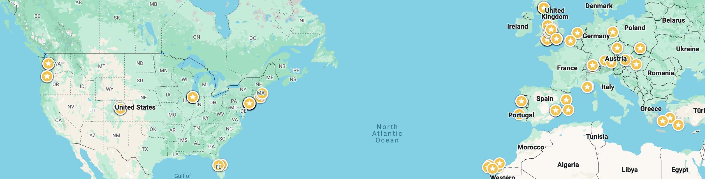

# Travel

Inspired by Dylan Egan https://github.com/dylanegan/travel to log past and future travels

# 2014

* Amsterdam, NED

# 2015

* Olu deniz, Turk
* Munich, GER
* Salzburg, AUS
* Brugge, BEL

# 2016

* Barcelona, ESP
* Palma de mallorca, ESP
* Tenerife, ESP
* Budapest, HUN
* Bratislava, Slovakia
* Vienna, AUS

# 2017

* Lisbon, PORT
* Porto, PORT
* Prague, Czech

# 2018

* Nice, FR
* Monaco, FR
* Izmir, Turkey
* Berlin, GER

# 2019

* Valencia, Esp
* Boston, Ma
* Bristol, UK  (5th Year Anniversary)
* Denver, Co, USA company meetup
* Boulder, Co, USA
* Amsterdam, NL 

# 2020

* Chicago, Il, USA, company meetup
* Izmir, TR

# 2021

* September-October Mykonos, GR Team meet up
* October London team meetup
* October Edinburgh, Scotland

# 2022
* Porto, Portugal company meet up
* Disney world, Orlando Florida USA
* Lanzarote, Canary Islands, Spain
* November, Zurich and Lucern, Hiked Mount Gigi, Switzerland
* November, Austria, company meetup

# 2023

* Seattle, Portland, April Amazing vacation

We took the grey hound bus to Portlands, visited the Arboretum (trees!), had lots of amazing food, coffee, craft beer.

* Valencia, June

* Fuerteventura, August

all inclusive sit on the beach holiday!
Electric scooters down the beach front!

* Krakow, October

* New york, November

Actually this started in London and we saw Jessie Ware and ate at La mia mamma, which was out of this world.
NYC was awesome, museums, food (Ivan Ramen), thanksgiving day parade, shopping.

* Gran Canaria, December

Very chill work meet up!

# 2024
* Geneva
* Disneyland Paris and the Louvre
* Edinburgh
* Thessaloniki, Greece
* Sarigerme, Turkey
* Malta (Valleta, Sliema, Mdina)
* Amsterdam
* San Fransisco

# 2025

* Boston, USA
* Stockholm, Sweden
* Antalya, Turkey
* Rome, Italy
* Malta (Gozo)

## Future

* Marseilles
* Australia
* Florence
* Naples
* Canada
* Dubrovnik
